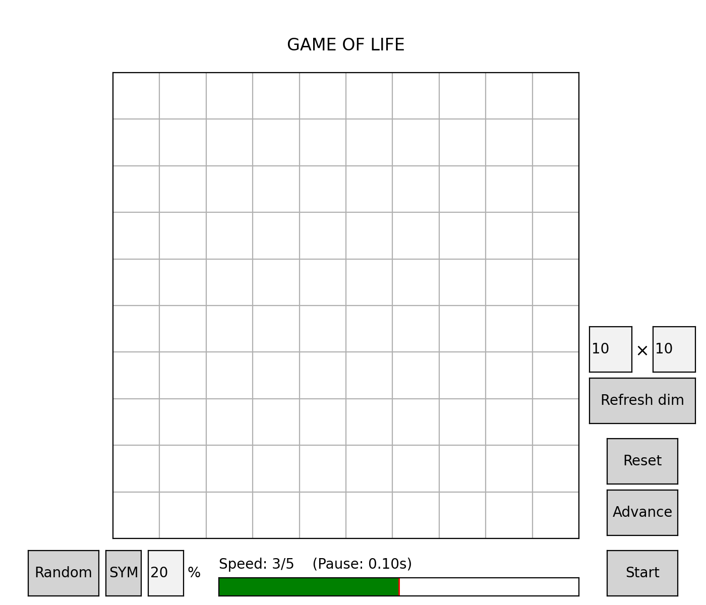

# Game of life (GUI)

This is a small hobby based project where I implemented a graphical user interface (GUI) for [Conway's Game of Life](https://en.wikipedia.org/wiki/Conway%27s_Game_of_Life) as a way of getting familiar with some of the functionalities of matplotlib.widgets.

## Rules 

Game of life is a zero-player game which plays out on a 2D board of cells (dead or live). To start the game one must choose a configuration of live cells. The game then proceeds generation by generation following the rules:

1. Any live cell with two or three live neighbours survives.
2. Any dead cell with three live neighbours becomes a live cell.
3. All other live cells die in the next generation. Similarly, all other dead cells stay dead.

## Basic usage

To try out the GUI simply run 

``` 
python GAME_of_LIFE.py
```
This should prompt the following matplotlib window.

<p align="center">
    
</p>

To set up and start a game use the features as explained in the following.

|  Actions | Functionality | 
|---|:---|
| Click on a square in the grid. | Toggles cell live/dead (black/white). |
| Enter number: $\fbox{0-100}$ \%, in the percentage text field. | Sets the probability for a cell live be on when generating random configurations (default is 20 \%).|
| Click the **Random** button. | Generates a random configuration of uniform distribution corresponding to the set probability. | 
| Click the **SYM** button.| Generates a random configuration of uniform distribution for half the grid corresponding to the set probability and mirrors it to the other half through the vertical axis.|
| Set slider level (5 options) | Set game advancing speed as number of seconds to pause between generations (Note that this is a little glitchy as it is affected by mouse movemenet). |
| Enter numbers $\fbox{1≥} \times \fbox{1≥}$. | Set custom dimension for the grid in terms of number of cells in x and y direction (default is $10 \times 10$). |
| Click the **Refresh dim** button | Update the grid after seting new custom dimensions. |
| Click the **Reset** button. | Put all cells back to a dead-state. |
| Click the **Advance** button. | Advance the configuration by one generation |
| Click the **Start/Stop** button. | Start and stop the advancing of the game. |


## Requirements

In order to run the code you need to have Python 3 with matplotlib. I used Python 3.8.3 and matplotlib 3.3.2.

## Example


<p align="center">
    
    <h5 align="left"> 
    1000 generations of a $100 \times 100$ grid initiated with a 15% live-probability random configuration.
    </h5>
</p>